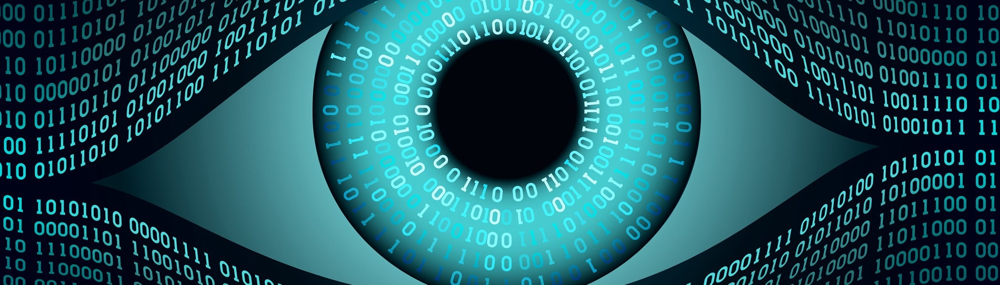

# Data- The New Oil
Can the increased adoption of digital identities enable the control and manipulation of personal data by powerful actors, and contribute to an existential threat to human rights and free-will on a global scale

## Abstract
- It is almost impossible to function in the modern world without the use of the internet. This has led to the creation of large digital identities, through the use of different websites who track that use through digital surveillance. The amount of information now available online about an individual has been commodified by corporations who aim to use it to control and manipulate people. If it continues in the same way, this manipulation will lead to the removal of humanity’s free-will, posing an existential threat.

## Table of Contents

01 [Introduction](#01-introduction)  
02 [Definitions](#02-definitions)  
03 [The Growth of Digital Identities](#03-the-growth-of-digital-identities)  
04 [Data Surveillance](#04-data-surveillance)  
05 [Existential Threat?](#05-existential-threat)  
06 [Conclusion](#06-conclusion)

### 01-Introduction
- This essay sets out to critically investigate the relationship between the growing reliance of digital identities and the potential of it leading to an existential threat to humanity, by causing the destruction of a desirable future. The desirable future being referred to throughout this essay is one in which humans have free will to make their own choices and decide their own future. This future is put at risk by the practice of data surveillance which has led to a surveillance based economy, where consumer information is the commodity that must be given in order to access the internet.  By the end of this essay, it will be possible to offer a critical evaluation of whether this is a realistic threat to humanity. 

### 02-Definitions:

- Data surveillance: [Includes](https://journals.sagepub.com/doi/full/10.1177/0268396218815559) overt direct collection, covert direct collection and covert indirect collection to take information from consumers whenever they are on the internet. Overt is data we willingly give a corporation we are interacting with. Covert is when we are directly interacting and they use cookies to take extra information. Covert indirect is when we’re on a completely different site and they use cookies to track us and share these with a third party.

- Digital identities: [The sum of all](https://ieeexplore.ieee.org/abstract/document/1337889) the digitally available information about us. Including information such as, name, date of birth, address, email address and online habits.  

- Existential threat: In this context I have used Nick Bostrom's [definition](https://onlinelibrary.wiley.com/doi/epdf/10.1111/1758-5899.12002)‘An existential risk is one that threatens the premature extinction of Earth-originating intelligent life or the premature and drastic destruction of its potential desirable future development.’  In this instance we will be looking at how manipulation of online data can be used to ‘tame’ human beings and how this is a drastic destruction of humanities potential.

### 03-The Growth of Digital Identities
One good way of illustrating our digital identity is by using a Visitor and Resident Map (V&R Map). This is a process designed by [David White](https://daveowhite.com/vandr/vr-mapping/) in order to explore an individual’s engagement with the web.  The below image is a V&R map of my own engagement with the web. In the context of my research question, the main take away I had from analysing this map was how the majority of websites on there asks for my data in order to access it. This includes websites where you are only a visitor, so not knowingly leaving any trace of being there. While I do not post anything on Facebook or interact with any communities, [cookies](https://www.emerald.com/insight/content/doi/10.1108/14636691111174243/full/pdf?title=social-media-and-cookies-challenges-for-online-privacy) are being used to monitor what I am looking at on there, who I am friends with and what posts I like, allowing them to build up a picture of me as an individual. It also includes institutional websites that you are required to use for work, meaning if you are not willing to give away your data you are not able to work. For me these are websites such as Talis and Jstor, both of which I am reliant on to find research for my university work, such as this paper. If I did not have access to these sites, I would be closing off my access to millions of documents that I could use for my degree. Almost every job has specific websites it needs to access in order to complete their work, even most manual labour jobs are required to log in to a payroll website and to sign in to work through a thumb print scanner. This means unless they are willing to allow cookies to collect their data, they will not be able to work. 

### 04-Data Surveillance

As discussed, in recent years use of the internet comes at the price of personal data. It is impossible to visit a modern website without agreeing to share your data with not just the site you are visiting but also third parties. Personal identifiable information (PII) uses data to confirm an individual’s identity and can be used to track individuals’ habits across multiple websites. The way this works is by using [cookies](https://www.emerald.com/insight/content/doi/10.1108/14636691111174243/full/pdf?title=social-media-and-cookies-challenges-for-online-privacy). Cookies are pieces of data that websites can store on an individual’s computer to remember information about them. Most modern websites rely on cookies to provide their service. For example, in order for Amazon to remember what you have placed in your shopping basket it needs to use cookies. However, this use of cookies has developed over time to collect more and more information on internet users. These cookies are invisible and can develope a profile on a person without them having any knowledge about it, collecting data such as what they have liked on Facebook or interacted with on Twitter.  By doing this corporations are able to build an image of individuals as consumers, tracking their habits to predict what they will do next. “PII is the currency users use to gain access to a website”.  This isn’t necessarily a bad thing, companies having information about your individual habits is justified through personal suggestions as to what you want to see when you are online, such as personalised a)ds. This leads to a curated experience online, arguably giving the consumer the best possible experience on the web.
Where this becomes dangerous is the development of what Zuboff [calls](https://www.theguardian.com/books/2019/oct/04/shoshana-zuboff-surveillance-capitalism-assault-human-automomy-digital-privacy) ‘Surveillance Capitalism’, which takes this data and applies it in a way which does not have the individual’s best interest in mind. Data is the new oil. It is a raw material which can be used by powerful actors to create guaranteed revenue streams. Once these actors have collected enough data to categorise internet users, they able to target them in such a way they can guarantee the result they are aiming for. Shoshana Zuboff [explains](https://www.google.co.uk/books/edition/The_Age_of_Surveillance_Capitalism/i_asswEACAAJ?hl=en) “Nearly every product or service that begins with the word “smart” or “personalised”, every internet-enabled device, every “digital assistant”, is simply a supply-chain interface for the unobstructed flow of behavioural data on its way to predicting our futures in a surveillance economy.” 

### 05-Existential Threat?
This is a threat because these people who use our data are trying to tame us as humans to act in whatever way they want to. What they are aiming for is ‘The gradual, slight, imperceptible change in your own behaviour and perception that is the product’ according to Netflix's [Social Dilemma](https://www.netflix.com/title/81254224). By showing you what they know you will react to, they can slowly change the way humans think. This can be used in a capitalistic sense in order to get you to buy a certain product or service, but also in a political way. [Facebook have admitted to](https://www.vanityfair.com/news/2018/07/the-man-who-created-the-world-wide-web-has-some-regrets) exposing over 80 million users data to a third party company called Cambridge Analytica.  Companies, such as Cambridge Analytica, are in the business of sending targeted ads to internet users in order to make them act a certain way politically and have been linked to the Donald Trump campaign.  Whether this is to support a certain party/candidate or to turn them against something, these people commodify the way you think. This method of surveillance capitalism is the ‘default model of every start-up and app developed in Silicon Valley’ according to [Zuboff](https://www.theguardian.com/books/2019/oct/04/shoshana-zuboff-surveillance-capitalism-assault-human-automomy-digital-privacy).

This is an existential threat to human kind because it poses a destruction of any desirable future. What we are looking at is a future where humans are tamed by powers behind the internet and free-will becomes an illusion. All of our actions will either be predicted and capitalised on or they will be decided for us through subliminal messaging fed to us through the websites we frequent. It is not just a threat to democracy, but a threat to free will.

### 06-Conclusion
Looking at this possible future through a critical lens, it seems foolish not to think it very likely. Humanity as a whole relies on the internet for almost everything we do. If someone decides to boycott the internet they are left behind by society. Once someone is on the internet it is near impossible to avoid the use of cookies and third party tracking. Every site we use is profiling us for the intention of commodifying our data. Once enough people are profiled and these entities have the option to ‘tame’ us and ‘automate’ our actions, it seems foolish to think that they would not use this for their own purposes. Although not fully destroying life on Earth, this qualifies as an existential threat as it will destroy our current way of life and a desirable future. Taking away humanities free will and enslaving us to a few powerful actors who have invested in information gathering.

However, this future is not determined for humanity. While humanity's attachment to the internet seems unseverable, at least for the time being, certain people and organisations are working to make this a safer experience for users. For example, David Berners-Lee (the inventor of the internet) told journalists he is currently working on a new platform [Solid](https://www.vanityfair.com/news/2018/07/the-man-who-created-the-world-wide-web-has-some-regrets) designed to give users back control of their data. With projects like this emerging there is still a chance that the threat outlined may be avoided, but those trying to avoid it are competing against very powerful forces.

### 07-Methodology 
To begin I need to acknowledge the work that has been completed in seminars over the 12 weeks of Autumn Term. I do not want to go through week by week describing what I learned and how it was useful for this website, but the workshop style of the seminars allowed us to explore different ideas specific to our own projects and was invaluable in creating my final project.
For my research I had the idea of focusing on data as a currency used to access the internet. I originally had this idea of data holding value when I saw Spotify offering a free £50 Google Nest in exchange for giving them more data.
Once we were given the project of digital identities and existential threats there wasn’t a clear link between this and the topic I wanted to work on. I started research into my chosen area, with the hope that a link would become clear as I went deeper into the issue. This happened very quickly as I realised the extent to which companies were controlling individual behaviour through the online platform and how this could be seen as a threat to humanity’s future as a whole making it an existential threat by Nick Bostrom’s definition. 
After I had an idea of how they all linked together I was struggling to phrase it in a way I was happy with in my research question. In order to do this I used [Chat GPT](https://chat.openai.com) which had been shown to us in class. I told the computer a vague description of what I wanted and then kept asking it to edit the results with different key words and phrases until I got a result I was happy with. 
I knew I wanted to present my website in essay form as that is the format I use in my own discipline (history) and would therefore be most comfortable with. 
To start my research, I first found articles that were on similar topics of cookie use on websites. This is not a field I am familiar with, so I was not sure on specific key words to use. Once I had started to read some general articles, I was able to find more specific key words such as: Data Cookies, Data Surveillance, Surveillance Capitalism and Behavioural Modification.
Once I had completed by research and written my draft, I needed to format it into a website. To do this I used GitHub and followed the instructions given to us in class. After a discussion in class I decided to format my website as one page, with a table of contents allowing a viewer to navigate between sections. I believe this was the best format to complement my writing style. On this page I added images that I had used an image compressor to format, in order to make it more appealing to a reader.
